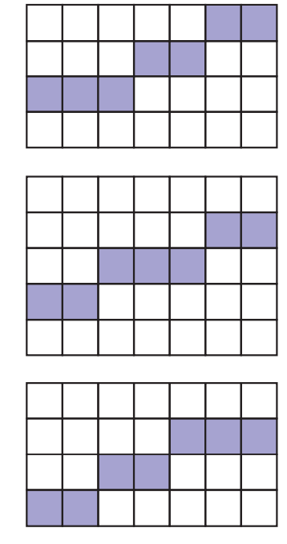

# How 3d Graphics

1. start with 3d scene represented in triangle meshes. 
2. (per vertices)for each vertice of all triangles, do projection * view * model transform.
3. do clipping on the result triangle vertice pairs.
4. perform perspective divide.
5. perform viewport transform.
6. face culling to remove back face.
7. rasterize the resulting triangle primitive.
8. (per pixel) perform z buffer test.  


In real-time rendering, the graphics system (cpu, gpu, monitor) performs series of computation on a 3D scene, and transforms it into a 2D image for display. The whole process is commonly known as computer graphics pipeline.

To understand how a 3d computer graphics pipeline works. Let's start with a simpified version of the same problem. how does a 2d graphics pipeline work?

## A 2d Rendering Pipeline : Rasterization

First problem we need to solve is: How do we describe a scene in 2d world?

In a simple approach, a 2d scene can be modeled in vector graphics, in which a line can be defined by a pair of starting and ending points, a triangle is formed by 3 vertices, and a circle: center point and a radius.

Rendering a 2d scene to a computer display is a seemingly simple task. We just need to travese every pixel covered by the 2d object and set the color of that pixel accordingly. This process of taking vector graphics into a series of pixels(raster image), is called rasterization. 

### Drawing a Line
It sounds simple, but the issue arises when you really get your hands dirty and try to implement a simple rasterization algorithm. As the image below shows: when you draw the line from the left end point to right, you have the choice of drawing the pixel at the same height as the left pixel or a pixel higher. Because of the different criterions we might use, we ended up with 3 ways to drawing the same line.


> image from "Fundamentals of Computer Graphics"

A common approach used to solve this ambiguity is to look at the midpoint of the line between the two potential pixel centers. If the pixel just drawn is pixel(x, y), the candidate pixel to be drawn will be either pixel(x + 1, y) or pixel(x + 1, y + 1). The midpoint of the two is (x + 1, y + 0.5). If the line passes below this midpoint, we draw the bottom pixel, and otherwise we draw the top pixel.

in pseudocode:
```cpp

int x0, y0, x1, y1
// implicit equation of the line
function f(x, y) {
    return (y0 - y1)*x + (x1 - x0) * y + x0*y1 - x1*y0
}

function drawLine() {
    int y = y0
    for(int x = x0; x <= x1; x++) {
        draw(x , y)
        if(f(x + 1, y + 0.5) < 0) {
            y = y + 1
        }
    }
}
```

### Drawing a triangle

With our line drawing ability checked, let's move on to a slightly more complex problem: how to rasterize a triangle. Just like in midpoint line drawing method we use mid point and implicit line function to choose between the candidate pixel, We can utilize the barycentric coordiantes to dicide if the pixel lies inside of the triangle or outside.

But drawing a triangle is much more problematic. what to do if the candidate pixel is exactly on the edge of the triangle? If two triangle share the same edge, which triangle does this pixel belong to? we need to find a way to break ties when this happens.

The approach in graphics APIs such as OpenGL and DirectX is the top-left rule. A pixel is awarded to a triangle only if the pixel is either inside the triangle or lies on either top edge or left edge of a triangle. Top edge and left edge is defined like this:

```
topLeftedge = y1 - y0  >= 0
```

### Clipping

#### clipping individual points.

xmin < x  < xmax && ymin < y < ymax

otherwise. discard.

#### brute force line clipping. 

intersect the line with each of the four clip-rectangle edges to see whether any intersection points line on those edges. next we test whether this intersection is interior or not.

#### the cohen-suerland line clipping

1. end points pairs are checked for trivial acceptance or trivial rejected.
2. if not trivial-acceptance or trivial-rejected, divied into two segments at a clip edge.
3. iteratively clipped by testing acceptance or rejection.

```cpp
const xMin, yMin, xMax, yMax

function computeOutCode(x, y) {
    code = b0000;
    if(y > yMax) code |= b0001
    else if(y < yMin) code |= b0010
    else if( x > xMax) code |= b0100
    else if(x < xMin) code |= b1000
    return code
}

function CohenSutherlandClipping(x0, y0, x1, y1) {

}

```


## Culling

view volumn colluing

occlusion culling

backface culling


